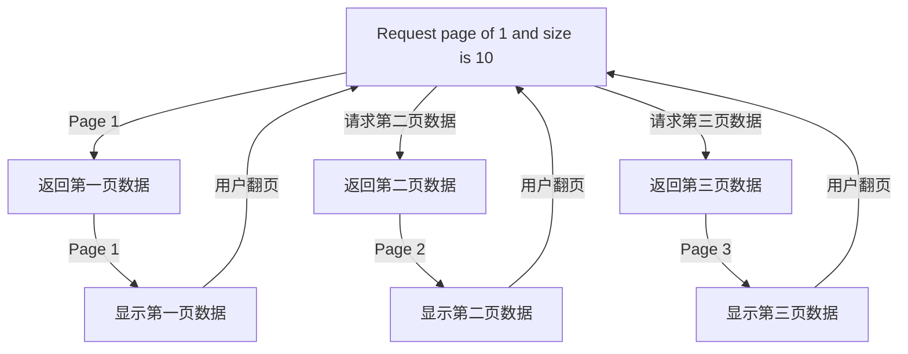

# Pageable API

What is Pageable: A set of data partitioned into fixed-sized sections, where obtaining a specific partition's data
collection is based on the index of the partition.



> And there is pageable able todo
```kotlin
interface PageableCollection<T, C : Collection<T>> {
    var pageNo: Int

    var pageSize: Int

    fun page(
        pageNo: Int,
        pageSize: Int,
    ): C

    fun checkPageArgument(pageNo: Int, pageSize: Int) {
        require(pageNo > 0) { "Page number should be non-negative." }
        require(pageSize > 0) { "Page size should be positive." }
    }

    fun totalPage(size: Int): Int

    fun current(): Int

    fun totalSize(): Int

    fun hasNextPage(): Boolean

    fun hasPreviousPage(): Boolean

    fun getNextPage(): Int

    fun getPreviousPage(): Int
}
```